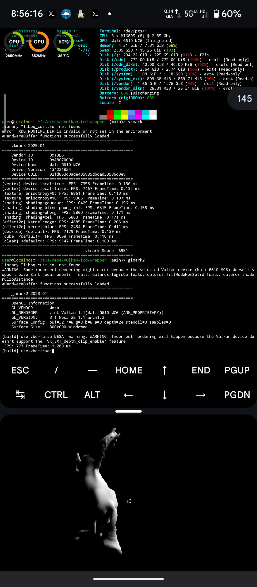
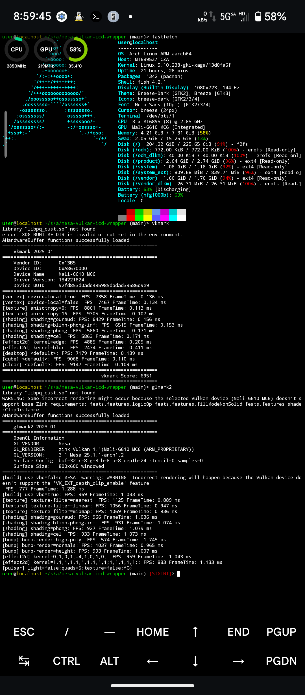

# Android Vulkan Bridge

Run Android Vulkan drivers on GNU/Linux containers via libhybris, enabling GPU acceleration on Termux X11.



## Overview

This repository provides packages to bridge Android's Vulkan drivers with GNU/Linux userspace, allowing:

- Native Vulkan applications (vkmark, vkcube, etc.)
- OpenGL via Zink (Mesa's OpenGL-over-Vulkan)
- X11 DRI3 support for Termux X11

## Tested Hardware

- **Device**: Redmi Note 11T Pro+ (xaga)
- **SoC**: MediaTek MT6895 (Dimensity 8100)
- **GPU**: Mali-G610 MC6
- **OS**: Android 16
- **Container**: Arch Linux ARM

## Prerequisites

- Root access on Android device
- Termux X11 installed
- GNU/Linux container (Arch Linux recommended)
- Android 11+ (API level 30+)

## Installation

### Step 1: Mount Android Resources

Ensure the following Android paths are accessible in your container:

**Required mounts:**

- `/system` - Android system partition
- `/vendor` - Vendor partition with GPU drivers

How you mount these depends on your container setup (proot, chroot, lxc, etc.).  

Then copy everything in `/apex/com.android.runtime` and `/apex/com.android.i18n/` to `ROOTFS/apex`.

### Step 2: Patch libc.so

The Android bionic libc needs a patch to work properly with libhybris: 

```bash
# Download patched libc.so
LIBC_URL="https://github.com/Linux-on-droid/vendor_lindroid/raw/lindroid-22.1/prebuilt/arm64/libc.so"
LIBC_PATH="/apex/com.android.runtime/lib64/bionic/libc.so"

# Backup original
sudo cp "${LIBC_PATH}" "${LIBC_PATH}.bak"

# Replace with patched version
sudo curl -L "${LIBC_URL}" -o "${LIBC_PATH}"
sudo chmod 644 "${LIBC_PATH}"
```

### Step 3: Build and Install Packages

Clone this repository and build packages in order:

```bash
git clone https://github.com/kde-yyds/android-vulkan-bridge.git
cd android-vulkan-bridge

# Build packages (in order)
cd android-headers-30 && makepkg -si && cd ..
cd libhybris && makepkg -si && cd ..
cd ahb-wrapper && makepkg -si && cd .. 
cd vulkan-wsi-layer && makepkg -si && cd ..
cd mesa-vulkan-icd-wrapper && makepkg -si && cd .. 
```

### Step 4: Test Vulkan

```bash
# Verify Vulkan device detection
vulkaninfo | head -30

# Test Vulkan rendering
vkcube
vkmark

# Test OpenGL via Zink
glxinfo | grep "OpenGL"
glmark2

# Test Chromium with GPU acceleration
chromium --use-vulkan --enable-features=Vulkan --disable-gpu-compositing
```

## Package Descriptions

| Package | Description |
|---------|-------------|
| **android-headers-30** | Android API level 30 headers for building Android-dependent packages |
| **libhybris** | Bridge layer enabling GNU/Linux programs to use Android bionic libraries |
| **ahb-wrapper** | Wrapper for `AHardwareBuffer` API |
| **vulkan-wsi-layer** | Vulkan layer adding X11 DRI3/Present support for window system integration |
| **mesa-vulkan-icd-wrapper** | Android Vulkan driver wrapper |

## Troubleshooting
Common issues:
### OpenGL applications fail with Zink

```bash
# Check Mesa version (25.1.2 recommended)
pacman -Qi mesa | grep Version

# If using newer Mesa, downgrade: 
# Mesa >25.1.2 has a Zink regression
```

### Chromium GPU process crashes with window manager

When using a window manager with compositing, Chromium GPU process will crash due to transparent windows. 

**Workaround:**
```bash
# Disable GPU compositing for Chromium
chromium --use-vulkan --enable-features=Vulkan --disable-gpu-compositing
```

## Known Issues

- **Mesa > 25.1.2**: Zink regression breaks GLX/DRI screen creation. **Recommended: Stay on Mesa 25.1.2**.
- Bad compatibility due to lack of extensions on most devices. **Use freedreno/turnip instead if you have Adreno GPU**.

## Performance

Benchmarks on Mali-G610 MC6 @ 850MHz (Dimensity 8100):

```
vkmark:         ~7000 FPS (default scenes)
glmark2 (Zink): ~900 FPS (default scenes)
```

